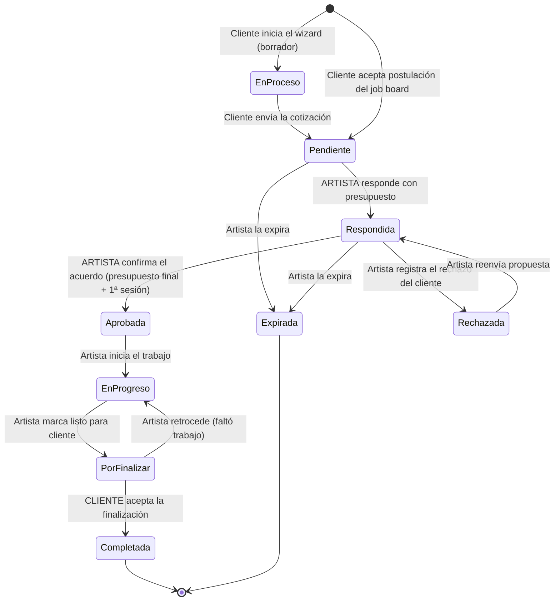

# Manual de Usuario — We Ötzi

Actualizado: 2026-07-19
Alcance: comportamiento real de la aplicación según el código del repositorio (`server.js`, `public/`, `supabase/migrations/`) y las políticas vivas del proyecto Supabase. Donde una función existe a medias o no está disponible, se indica explícitamente (ver [§14 Limitaciones conocidas](#14-limitaciones-conocidas-y-funciones-no-disponibles)).

---

## Índice

1. [Qué es We Ötzi y tipos de usuario](#1-qué-es-we-ötzi-y-tipos-de-usuario)
2. [Cuentas y acceso](#2-cuentas-y-acceso)
3. [Manual del Cliente](#3-manual-del-cliente)
4. [Manual del Artista](#4-manual-del-artista)
5. [Manual del Estudio](#5-manual-del-estudio)
6. [Manual de Soporte](#6-manual-de-soporte)
7. [Manual de Administración (Backoffice)](#7-manual-de-administración-backoffice)
8. [Ciclo de vida de una cotización](#8-ciclo-de-vida-de-una-cotización)
9. [Ciclo del Job Board](#9-ciclo-del-job-board)
10. [Ciclo Estudio ↔ Artista](#10-ciclo-estudio--artista)
11. [Quién aprueba qué (resumen)](#11-quién-aprueba-qué-resumen)
12. [Matriz de permisos](#12-matriz-de-permisos)
13. [Notificaciones por email](#13-notificaciones-por-email)
14. [Limitaciones conocidas y funciones no disponibles](#14-limitaciones-conocidas-y-funciones-no-disponibles)

---

## 1. Qué es We Ötzi y tipos de usuario

We Ötzi conecta a personas que quieren tatuarse con artistas y estudios de tatuaje. El flujo central es la **cotización**: el cliente describe su tatuaje, el artista responde con un presupuesto, coordinan por chat, se agenda y se completa el trabajo, y ambas partes pueden dejarse reseñas verificadas.

| Tipo de usuario | Quién es | Entrada principal |
|---|---|---|
| **Visitante (sin cuenta)** | Cualquier persona | `/quotation`, `/pre-cotizador`, `/marketplace`, `/explore`, `/studio-spots`, perfiles públicos |
| **Cliente** | Persona que quiere tatuarse | `/client/login` → `/client/dashboard` |
| **Artista** | Tatuador/a con perfil público | `/registerclosedbeta` (login) → `/artist/dashboard` |
| **Estudio** | Negocio con sedes y roster de artistas | `/studio/login` → `/studio/dashboard` |
| **Soporte** | Equipo interno de We Ötzi | `/support/login` → `/support/dashboard` |
| **Administrador (superadmin)** | Cuenta única de administración global | `/backoffice/login` → `/backoffice` |

Notas de navegación:

- La raíz `/` redirige a `/quotation`.
- `/quotations` es solo un alias que redirige a `/quotation` (conserva parámetros).
- En casi todas las páginas hay un **widget flotante de chat de soporte** (funciona incluso sin cuenta).

---

## 2. Cuentas y acceso

Todos los tipos de usuario se autentican con **email + contraseña** (Supabase Auth). El "tipo" de cuenta se determina por dónde se registró (cliente, artista o estudio); una misma dirección de email corresponde a un solo tipo.

| Tipo | Registro | Login | Recuperar contraseña |
|---|---|---|---|
| Cliente | `/client/register` (también con Google) o al publicar en el job board | `/client/login` (email/contraseña o Google) | ⚠️ El link "Olvidé mi contraseña" **no funciona actualmente** (el servidor rechaza la solicitud). Pedir al equipo de We Ötzi una contraseña temporal |
| Artista | `/register-artist` (wizard) o `/registerclosedbeta` | `/registerclosedbeta` (modal "Iniciar Sesión") o `/artist/login` | ⚠️ Igual que cliente: **no funciona**; pedir al equipo |
| Estudio | `/studio/register` (5 pasos) | `/studio/login` | ◐ "Recuperar acceso" envía un **link por email que te vuelve a dar acceso**, pero hoy no hay pantalla para definir una contraseña nueva tras abrirlo |
| Soporte | No hay auto-registro: las cuentas las crea el Administrador | `/support/login` (requiere email `@weotzi.com` + estar activo como agente) | Lo gestiona el Administrador |
| Administrador | Cuenta única predefinida | `/backoffice/login` (solo pide contraseña) | — |

Importante:

- **No se exige verificar el email**: las cuentas funcionan inmediatamente después de registrarse.
- Los botones "Continuar con Google/Apple" del registro de **artista** no hacen login real con esas plataformas: solo marcan el origen y llevan al wizard de email + contraseña. El botón "Continuar con Instagram" activa la **importación del perfil público** de Instagram (fotos, bio, link), no un login. El Google real solo existe en el registro/login de **cliente**.
- Soporte puede asignar una **contraseña temporal** a los artistas desde su panel (el sistema lo soporta también para clientes y estudios, pero sin interfaz de Soporte — esos casos los resuelve la Administración); el Administrador puede cambiar la contraseña de cualquier usuario.

---

## 3. Manual del Cliente

### 3.1 Estimar el precio sin compromiso — `/pre-cotizador`

Formulario de una página, sin cuenta:

1. Describe tu **idea** (mínimo 5 caracteres).
2. Elige **estilo** y **tamaño**.
3. Elige **zona del cuerpo** y subzonas.
4. Escribe tu **ciudad** (con autocompletado).
5. Pulsa **"Calcular aproximado"**.

Recibes: un **rango de precio estimado** (basado en las tarifas de artistas compatibles por estilo y ubicación), **sesiones estimadas** según el tamaño, un nivel de **confianza** (alta/media/baja según cuántos artistas comparables hay) y hasta **6 artistas sugeridos**. El botón "Cotizar con este artista" te lleva al wizard de cotización con tus respuestas ya cargadas (saltas los pasos que ya contestaste). El precio final siempre lo define el artista.

### 3.2 Pedir una cotización — `/quotation`

Wizard paso a paso; **no requiere cuenta**. Barra de progreso, botón para volver atrás, y botón de login en el encabezado por si ya tienes cuenta.

**Pasos** (orden por defecto):

1. **Bienvenida** → Comenzar.
2. **Buscar artista** por su usuario (ej. `yomicoart.wo`). Si no conoces ninguno: enlace "Buscar artistas" (abre el marketplace) o botón **"Continuar sin artista"** (al final te recomendará artistas). Al elegir artista se genera tu ID de cotización (`QN#####`) y desde ahí **todo se autoguarda como borrador** — puedes cerrar el navegador y retomar después.
3. **Confirmar artista** (tarjeta con foto, estilos, ubicación y tarifa).
4. **Zona del cuerpo**: zona principal → lado (izquierdo/derecho/ambos) → subzonas. Cada zona tiene un botón ⓘ con información de sensibilidad/dolor.
5. **Tu idea** (10–1000 caracteres).
6. **Tamaño** (de Pequeño <5cm hasta Espalda/Pecho completo).
7. **Estilo** (catálogo con descripciones y subestilos). Si no coincide con los estilos del artista te lo advierte, pero no te bloquea.
8. **Color** (full color, blanco y negro, grises, líneas, toques de color).
9. **Referencias visuales** (opcional): hasta **4 imágenes** (acepta HEIC; se comprimen solas).
10. **¿Primer tatuaje?** / **¿Cover-up?**
11. **Datos personales**: nombre, email, WhatsApp, fecha de nacimiento, Instagram (opcional), condiciones médicas y alergias (si aplican), ciudad.
    - Si ya cotizaste antes con ese email, te ofrece **reutilizar tus datos**.
    - Si tu ciudad no coincide con la del artista, te pregunta si estás **dispuesto a viajar**.
12. **Fechas** (rango deseado y/o "Tengo flexibilidad") y **presupuesto aproximado** (con moneda).
13. **Preferencia de contacto** (WhatsApp / Instagram / Email / Cualquiera).
14. **Recomendaciones** (solo si venías sin artista): top 3 artistas compatibles por estilo, ubicación y presupuesto.
15. **Resumen** con botones "Editar" por sección → **"Confirmar y Enviar"**.

**Al enviar**: la cotización pasa a estado **Pendiente**, tus referencias se guardan (y se copian a una carpeta de Google Drive vinculada a tu cotización), y recibes un **email de confirmación** con tu ID. La pantalla final te invita a **crear una cuenta gratis** con tus datos ya precargados — recomendable, porque la cuenta habilita el chat y el seguimiento.

### 3.3 Tu cuenta

- **Registro** (`/client/register`): nombre, email, contraseña (mín. 6), y opcionalmente WhatsApp, fecha de nacimiento, Instagram y ciudad. También "Registrarse con Google". Al crear la cuenta se **vinculan automáticamente todas las cotizaciones** hechas antes con tu email.
- **Login** (`/client/login`): email/contraseña o Google. Si te logueas y no tenías perfil de cliente, se crea solo.
- **Perfil**: desde el dashboard puedes editar foto, nombre, país, WhatsApp, ciudad, y activar un **alias público** (tu perfil público muestra tus reseñas). También puedes personalizar los colores del panel y el tema claro/oscuro.

### 3.4 Dashboard — `/client/dashboard`

Muestra tus estadísticas (total, activas, pendientes, completadas), accesos rápidos (Nueva Cotización / Buscar Artistas / Publicar Solicitud) y la lista de cotizaciones con pestañas **Todas | Activas | Pendientes | Completadas | Solicitudes**.

**Estados de tu cotización** (lo que significan para ti):

| Etiqueta | Qué significa | Qué puedes hacer |
|---|---|---|
| En Proceso | Borrador sin enviar del wizard, **o** el artista ya está trabajando en tu tatuaje | Si es borrador: volver a `/quotation` y terminarlo |
| Pendiente | Enviada; el artista aún no responde | Esperar / chatear |
| Respondida | El artista envió su presupuesto | Revisar y coordinar por chat |
| Aprobada | Se acordó presupuesto final y fecha de primera sesión | Esperar la sesión |
| Rechazada | Se registró que no aceptaste la propuesta | El artista puede reenviarte otra propuesta |
| Por finalizar | El artista marcó el trabajo como terminado | **Aceptar finalización** (botón) |
| Completada | Cerrada por ti | **Dejar reseñas** |
| Expirada (se muestra como `expired`) | Cerrada sin acuerdo | — |

> **Importante — cómo se aprueba un presupuesto:** la app **no tiene botones de "aceptar presupuesto" ni "confirmar fecha" para el cliente**. La negociación ocurre por **chat** (o WhatsApp/Instagram) y es el **artista** quien registra el acuerdo con su botón CONFIRMAR (eso fija el presupuesto final y agenda la primera sesión). Las **dos únicas aprobaciones formales del cliente** dentro de la app son: **aceptar la finalización** del trabajo y **aceptar/rechazar postulaciones** del job board.

**Acciones por cotización**:

- **Ver Detalle**: toda la información del tatuaje, del artista y tus preferencias, con link a tus referencias.
- **Chat**: mensajería en tiempo real con el artista (cada mensaje le llega también por email). Requiere tener cuenta.
- **Aceptar finalización** (solo en "Por finalizar"): confirma que el trabajo terminó → la cotización pasa a **Completada** y se habilitan las reseñas. Bloqueado si hay una disputa abierta con Soporte.
- **Reseñar artista / Reseñar estudio** (solo en Completada): reseñas verificadas con estrellas, comentario y fotos. Quedan **pendientes de moderación** por Soporte antes de publicarse.
- **Borrar**: oculta la cotización **solo de tu vista** (el artista y Soporte la siguen viendo). No se puede deshacer desde la interfaz.

### 3.5 Job Board — publicar una solicitud abierta

Si no tienes un artista en mente, publica tu idea y deja que los artistas se postulen.

**Publicar** (`/job-board/request`, wizard de 8 pasos): zona del cuerpo → idea (con checkboxes de primer tatuaje / cover-up) → tamaño → estilo (opcional) → color y hasta 4 referencias (opcional) → preferencias (presupuesto mín/máx, ciudad, fecha, flexibilidad, disposición a viajar) → **publicar**. El último paso **exige cuenta** (puedes registrarte ahí mismo). Hay borrador automático por 7 días.

**Gestionar** (pestaña "Solicitudes" del dashboard):

- Ves tus solicitudes con su estado y el contador de postulaciones (se actualiza en tiempo real).
- **Ver Postulaciones**: cada artista postulante muestra su perfil, mensaje, **precio estimado** y **sesiones estimadas**.
- **Rechazar** una postulación: la marca rechazada definitivamente (con confirmación).
- **Aceptar** una postulación — la decisión importante: *"Se creará una cotización con este artista y las demás postulaciones serán rechazadas."* Al aceptar:
  1. Se crea una **cotización Pendiente** con ese artista, con su oferta (precio y sesiones) ya registrada.
  2. Las **demás postulaciones se rechazan automáticamente**.
  3. La solicitud se **cierra y desaparece del feed** público.
  4. Se intenta avisar al artista por email (⚠️ hoy ese aviso puede no llegar — ver §14; el artista siempre lo ve en su sección de Postulaciones).
  Desde ahí, la cotización sigue el flujo normal (chat, estados, finalización, reseñas). **Irreversible desde la interfaz.**

⚠️ Una vez publicada, **no puedes editar ni cerrar manualmente una solicitud** desde la interfaz — solo se cierra aceptando una postulación. Tampoco puedes eliminar las imágenes de referencia ya subidas.

### 3.6 Descubrir artistas

- **`/marketplace`**: búsqueda inteligente + filtros (estilo, país, rango de precio, idioma, experiencia). Botones **Cotizar** y **Perfil** en cada tarjeta.
- **`/explore`**: mapa 2D con marcadores de artistas y estudios, con los mismos filtros.
- **`/explore/globe`**: globo 3D con panel lateral; muestra también las residencias e itinerancias de cada artista ("Aquí ahora" / "Próximamente").

### 3.7 Resumen: qué puede y no puede hacer un cliente

**Sin cuenta**: usar el pre-cotizador, enviar cotizaciones, explorar artistas/estudios y usar el chat de soporte. **No** puede publicar en el job board ni chatear con artistas.

**Con cuenta**, además: seguimiento de todas sus cotizaciones, chat con artistas, aceptar finalización, reseñas verificadas, job board completo (publicar/aceptar/rechazar), perfil público con alias.

**No puede**: aprobar presupuestos/fechas con un botón (se coordina por chat), editar o cancelar una cotización enviada, cerrar o editar una solicitud del job board publicada, deshacer un ocultado o una aceptación, abrir disputas desde el panel (se gestionan con Soporte), ni marcar el trabajo como terminado antes que el artista.

---

## 4. Manual del Artista

### 4.1 Registro — `/registerclosedbeta` → `/register-artist`

1. En `/registerclosedbeta` ingresa tu email y pulsa **REGISTRARSE** (o usa "Continuar con Instagram" para importar tu perfil público de IG). Se crea un **borrador** de registro: puedes cerrar y retomar donde quedaste.
2. El wizard tiene **11 pasos**: nombre artístico (define tu usuario `nombre.wo`, con verificación de disponibilidad en vivo) → nombre legal → email + contraseña → estilos (≥1, puedes crear estilos propios) → experiencia → **tarifa por sesión** (referencial) → portfolio (web, Instagram, otro, o "usaré We Ötzi"; puedes subir fotos/videos) → bio (opcional) → modalidad de trabajo (**Estudio / Independiente / Ambos**, con dirección o estudio asociado) → verificación de edad (**mayores de 18 únicamente**) → newsletter.
3. **Revisión final** + aceptar Términos y Condiciones → enviar.
4. Tu cuenta queda creada y entras al dashboard de inmediato. El estado "pendiente de validación" es **solo informativo**: tu perfil público ya es visible y puedes operar normalmente desde el primer minuto. La única revisión humana es la **verificación** opcional (insignia ✓, ver §4.8).

Si tu modalidad es Estudio/Ambos, el estudio y su sede se crean o vinculan automáticamente, y tu ubicación "Tatuando en" queda registrada con agenda abierta.

> 💡 Hay un **tour interactivo del panel de cotizaciones** en `/tutorial` (enlazado como "Cómo funciona" desde el registro).

### 4.2 Dashboard — `/artist/dashboard`

- **Navegación**: COTIZACIONES, JOB BOARD, SPOTS, INVITACIONES, CALENDARIO, ESTADÍSTICAS, VISITANTES, PERFIL, salir y tema.
- **Onboarding**: checklist de 4 hitos que se marcan solos (completar perfil, primera cotización, compartir WhatsApp, compartir perfil).
- **KPIs**: pendientes, respondidas del mes, postulaciones, spots/invitaciones, visitas de los últimos 7 días.
- **Galería de trabajos** (se edita aquí): tres categorías — **Trabajos realizados / Flash disponibles / Proyectos** — con subida de fotos y videos (límites: **12 archivos, hasta 2 videos MP4/MOV de máx. 80 MB y 30 s**), importador de Instagram, reordenar arrastrando y lightbox.
- **Mi perfil / Sobre mí**: tarjeta resumen + bio editable inline (280 caracteres).
- **Acciones rápidas**: ver perfil público, solicitar verificación, subir fotos, compartir perfil, **generar tarjeta QR** (de tu perfil o galería, PNG/SVG), cambiar contraseña.
- **Generar foto con IA**: crea un avatar a partir de un prompt (Gemini).
- **Visitantes** (`/artist/visitors/`): total, únicos, países, ciudades, feed en vivo y mapa de las visitas a tu perfil público.

La edición completa del perfil vive en **`/artist/profile/details`**: identidad, ubicación, estilos, experiencia, tarifa, portfolio, modalidad y estudio, **"Tatuando en" / "Próximamente tatuando en"** (residencias y viajes con fechas y agenda abierta/cerrada — esto alimenta el mapa y el globo), Instagram, WhatsApp, fecha de nacimiento y newsletter. El **email no se puede cambiar** desde el perfil.

### 4.3 Perfil público — `/artist/profile?artist=<usuario>`

Lo que ve cualquier persona sin cuenta: tu galería destacada, avatar con insignias (✓ verificado, ★ embajador), bio, estilos, experiencia y tarifa, redes y portfolio, **mapa mundial** con tus ubicaciones actuales y próximas, tus **reseñas**, y botones **Cotizar** / WhatsApp / Compartir. La galería completa por categorías está en `/artist/profile/gallery`. Cada visita alimenta tu mapa de visitantes.

### 4.4 Gestión de cotizaciones — `/my-quotations`

Tu centro de operaciones. KPIs (total, pendientes, ingresos confirmados), búsqueda, filtros por estado, orden y columnas configurables. Al hacer clic en una cotización se abre el **panel lateral (drawer)** con todo:

1. **Estado y prioridad** (la prioridad Baja/Media/Alta es solo organizativa, el cliente no la ve).
2. **Timeline visual** del progreso.
3. **Detalles** del tatuaje y del cliente + "Ampliar información" (contacto, salud, edad, viaje).
4. **Referencias** del cliente (con lightbox).
5. **Notas privadas** ("Artist Notepad"): documentos con formato (títulos, listas, checklists, imágenes, columnas), etiquetas, exportar a PDF/Word/Markdown, o enviar al chat. **El cliente nunca las ve.**
6. **Chat** en tiempo real con el cliente (con ✓✓ de leído). Solo disponible si el cliente tiene cuenta.
7. **Sesiones** (visible cuando la cotización está Completada): agendar, editar y cambiar estado de cada sesión.
8. **Botones de acción según el estado** (ver §8) + Editar campos + Archivar.
9. **Reseñar cliente** (en Completada, si el cliente tiene cuenta y no hay disputa abierta).

**Tus acciones clave sobre una cotización:**

| Botón | Cuándo | Qué hace |
|---|---|---|
| **RESPONDER** | Pendiente | Envías **tu presupuesto** (monto + moneda + sesiones estimadas). El cliente recibe un email |
| **CONFIRMAR** | Respondida | Registras el acuerdo alcanzado con el cliente: eliges el **presupuesto final** (el del cliente, el tuyo o uno personalizado), sesiones confirmadas y **fecha/hora de la primera sesión (obligatoria)**. Se crea automáticamente la sesión #1 agendada y el cliente recibe el email de sesión agendada |
| **REENVIAR** | Rechazada | Reabres la propuesta con nuevos términos |
| **INICIAR TRABAJO** | Aprobada | Pasa a En Progreso ⚠️ (ver nota) |
| **MARCAR LISTO PARA CLIENTE** | En Progreso | El cliente recibe el control: solo él puede cerrar la cotización |
| Dropdown → **EXPIRADA** | Pendiente o Respondida | Cierra sin acuerdo. ⚠️ Desde "Aprobada" el sistema lo rechaza |

> ⚠️ **Comportamiento conocido**: al pulsar INICIAR TRABAJO, la cotización pasa a "En Progreso" y **desaparece de tu lista y del calendario si recargas la página** (el sistema confunde ese estado con los borradores del wizard del cliente). Mientras no recargues, puedes seguir operándola desde el drawer; si la perdiste de vista, márcala "Listo para cliente" cuanto antes o pide ayuda a Soporte.

**Selección múltiple**: la barra bulk permite "Listo para cliente" (solo funciona sobre cotizaciones En Progreso; en otros estados da error), Archivar y Delete. ⚠️ **El Delete masivo desde esta lista no borra nada** (el sistema solo permite borrar cotizaciones ya archivadas): para eliminar definitivamente, primero **Archiva** y luego borra desde `/archive`.

**Archivo** (`/archive`): cotizaciones archivadas, con Desarchivar (reversible) y **Delete permanente** (irreversible, con confirmación).

**Estadísticas** (`/my-quotations/statistics`): ingresos (solo de Completadas con presupuesto final), conversión, ticket promedio, gráficos por mes/estilo/estado y top clientes.

### 4.5 Sesiones y calendario — `/calendar`

- Vista mensual/semanal con tus **sesiones agendadas** (por color según estado) y, para cotizaciones sin sesiones, la fecha preferida del cliente como referencia.
- Clic en un evento → abre el drawer de esa cotización (las sesiones **se crean y editan desde el drawer**, no dibujando en el calendario).
- Estados de sesión: **Agendada, Completada, No Asistió, Reprogramada, Cancelada**. Al crear, completar, reprogramar o cancelar una sesión, el **cliente** recibe un email (No Asistió no notifica; el artista no recibe copia).
- **Exportar .ICS** para tu app de calendario. El botón de Google Calendar solo funciona si el Administrador configuró la integración.

### 4.6 Job Board — `/job-board`

Feed público de solicitudes de clientes: descripción, estilos, tamaño, zona, ciudad, presupuesto del cliente y días restantes.

**Postular**: botón en la tarjeta → mensaje para el cliente (mín. 10 caracteres) + **precio estimado** + **sesiones estimadas** + nota de disponibilidad opcional. Una sola postulación por solicitud. El cliente la ve al instante en su panel.

**Seguimiento**: en `/my-quotations` → sección **POSTULACIONES** ves cada una con su estado (Pendiente / Vista / **Aceptada** / Rechazada). Si te aceptan: se crea automáticamente una **cotización Pendiente** con la oferta que hiciste — gestiónala como cualquier otra (⚠️ el aviso por email puede no llegar, ver §14: revisa tu sección de Postulaciones). Si el cliente acepta a otro artista, tu postulación queda rechazada automáticamente. No hay botón para retirar una postulación.

### 4.7 Estudios: invitaciones y spots

**Invitaciones** (`/artist/invitations`): cuando un estudio te invita a su roster recibes un email. En esta página ves la invitación (estudio, rol ofrecido — Residente / Itinerante / Guest / Manager — y sede) con:

- **Aceptar** → entras al roster del estudio: apareces en su perfil público y tu perfil queda asociado al estudio. *Tu perfil personal sigue siendo tuyo: el estudio no puede editarlo.*
- **Rechazar** → la invitación se descarta.
- **Salir** (en membresías activas) → te desvinculas del estudio cuando quieras, sin aprobación de nadie.

**Spots** (`/studio-spots`): directorio público de vacantes de estudios (Residencia / Itinerante / Guest spot) con split %, stipend, fechas y requisitos. Para postular necesitas cuenta de artista: mensaje para el estudio + URL de portfolio → **Postularme** (una postulación por spot). El **estudio decide**; si te acepta, **entras directo a su roster** (tu postulación cuenta como consentimiento) y recibes un email con la decisión. Para ver el estado, vuelve a abrir el spot (no hay un listado propio de tus postulaciones a spots).

### 4.8 Verificación de perfil (insignia ✓)

Desde el dashboard: **"Verificar mi perfil"** muestra los requisitos (documento de identidad, verificación de estudio, contacto verificable) y el botón **Solicitar verificación**. Eso marca tu solicitud como "Enviada"; **Soporte se pondrá en contacto** y decide el resultado: En Proceso → En Análisis → **Verificado** / Denegado / Cancelado. Si te la deniegan o cancelan, puedes volver a solicitarla. La insignia ✓ aparece en tu perfil público. El estado de **Embajador** y la marca "Selección Ötzi" los gestiona Soporte (para ti son de solo lectura).

### 4.9 Resumen: qué puede y no puede hacer un artista

**Puede**: registrarse solo y operar de inmediato; editar todo su perfil y galería; responder, confirmar, avanzar y archivar sus cotizaciones; notas privadas; chat; sesiones; calendario; estadísticas; postularse a job board y spots; aceptar/rechazar invitaciones y salir de rosters; solicitar verificación; reseñar clientes (tras Completada).

**No puede**: cerrar una cotización como Completada (eso lo hace el **cliente**); crear cotizaciones desde cero (nacen del cliente o del job board); aprobarse su propia verificación ni su estatus de embajador; aceptarse a sí mismo en un spot; borrar cotizaciones sin archivarlas primero; retirar postulaciones desde la interfaz; bloquear días del calendario (el botón solo enlaza al calendario); crear "listas" de cotizaciones (botón sin función); cambiar su email desde el perfil.

---

## 5. Manual del Estudio

### 5.1 Registro — `/studio/register` (5 pasos)

1. **Cuenta**: nombre del estudio, email, contraseña (mín. 8) y confirmación.
2. **Identidad** (opcional): tagline, bio, año de fundación, idiomas, Instagram (con importador del perfil público de IG), sitio web, WhatsApp.
3. **Sedes**: al menos una dirección completa (con autocompletado de Google). Puedes agregar varias; la primera es la principal.
4. **Fotos** (opcional): en el registro solo se aceptan **URLs** (la subida de archivos está en el dashboard).
5. **Confirmar** → **Crear estudio** → entras al dashboard.

**Login** (`/studio/login`): email + contraseña; "Recuperar acceso" envía un link por email que te vuelve a dar acceso (⚠️ hoy no hay pantalla para definir una contraseña nueva tras abrirlo). Una cuenta que no sea de estudio es rechazada.

### 5.2 Dashboard — `/studio/dashboard` (9 pestañas)

**Perfil**: edita identidad, portada, logo y galería — aquí sí con **subida de archivos**.

**Sedes**: agregar/editar/quitar sedes, marcar la **principal** (solo puede haber una). Al quitar una sede, los artistas asignados a ella quedan "sin asignar".

**Roster** — tu equipo de artistas (ver flujo completo en §10):

- **Invitar**: busca al artista por @usuario o nombre → elige **rol** (Residente / Itinerante / Guest / Manager) y **sede** → Invitar. El artista recibe un email y debe **aceptar** desde su cuenta.
- Tabla del roster: rol, sede y **split %** editables (cambios unilaterales tuyos, sin aprobación del artista); estado de cada membresía.
- Acciones: **Desvincular** (termina la membresía; te ofrece dejar una reseña del artista), **Cancelar** (elimina una invitación pendiente).

**Spots** — vacantes públicas:

- **Crear**: título, tipo (Guest spot / Residencia / Itinerante), descripción, estilos buscados, fechas, split %, stipend, vivienda incluida, imagen. Botones **"Guardar como borrador"** o **"Publicar (abierto)"** — solo los abiertos aparecen en `/studio-spots`.
- Por spot: **Postulaciones (N)** / Editar / **Publicar** (si es borrador) / **Cerrar** (si está abierto) / **Reabrir** (si está cerrado) / Borrar (borra también las postulaciones).
- **Revisar postulaciones**: por cada artista ves su perfil, portfolio y mensaje. **Aceptar** = el artista **entra directo al roster** (rol según el tipo de spot) y recibe email; **Rechazar** = recibe email de decisión. Decisiones definitivas.

**Operaciones** (Trabajos / Clientes / Facturas / Documentos):

- **Trabajos**: registra cada trabajo realizado — fecha, artista (del roster activo), cliente, horas, monto bruto y el reparto (split artista / estudio / insumos, montos manuales). **Es la fuente de todo Analytics.**
- **Clientes**: vista de solo lectura agregada desde los trabajos (sesiones, total, última visita).
- **Facturas**: libro **interno** (no fiscal, sin PDF) — número sugerido automáticamente (editable, único por estudio), cliente, fechas, items con cantidades y precios (totales calculados solos), IVA. Estados operables: borrador → **Marcar pagada**.
- **Documentos**: sube consentimientos, contratos, NDAs, listas de precios (bucket **privado**, máx. 20 MB) con flags "plantilla reutilizable" y "requiere firma".

**Inventario**: items con SKU, stock, nivel de reorden y costo; tarjetas de salud (items a **reponer** resaltados). Cada **movimiento** (Restock / Consumo / Pérdida / Ajuste, con artista opcional) actualiza el stock automáticamente.

**Proveedores**: directorio simple (nombre, categorías, contacto, notas).

**Sponsors**: nombre, tier (bronze/silver/gold/platinum), logo, vigencia, valor mensual, **"Mostrar en perfil público"** y qué artistas del roster patrocina. En el perfil público se ve nombre, tier, logo, web, fin de vigencia y hasta 3 artistas patrocinados (nunca los montos).

**Analytics**: resumen de 12 meses (bruto, neto, trabajos, clientes), desglose mensual y **performance por artista** — todo derivado exclusivamente de los Trabajos registrados: si no registras trabajos, Analytics queda vacío.

### 5.3 Perfil público — `/studio/profile?studio=<slug>`

El público ve: portada, tagline, contacto (IG/web/WhatsApp), bio, **estilos del equipo** (unión automática de los estilos de tu roster), **roster activo** (con link a cada artista), galería, sponsors públicos, reseñas del estudio, y mapa con todas tus sedes. La insignia **"Verificado"** del estudio solo la puede activar la Administración (backoffice).

### 5.4 Resumen: qué puede y no puede hacer un estudio

**Puede**: gestionar perfil, sedes, roster (invitar/editar rol-sede-split/desvincular), spots y sus postulaciones (aceptar = alta directa al roster), trabajos, facturas internas, documentos, inventario, proveedores, sponsors, analytics; calificar a un artista al desvincularlo.

**No puede**: editar el perfil de ningún artista; forzar una membresía sin consentimiento (la invitación queda pendiente hasta que el artista acepte — la excepción es el spot, donde postular ya es consentir); auto-verificarse; emitir facturas fiscales; ver datos de otros estudios; editar teléfono/horarios por sede (sin interfaz todavía); marcar postulaciones como "vista"/"shortlist", spots como "ocupado", ni facturas como "enviada/vencida" (estados sin botones).

---

## 6. Manual de Soporte

### 6.1 Acceso

`/support/login` con email **@weotzi.com** + contraseña. Además el Administrador debe haberte dado de alta como **agente activo** — sin eso, el dashboard te muestra "Acceso No Autorizado". Roles de agente: `support`, `supervisor`, `admin` (hoy casi equivalentes; el rol `admin` es el único que puede eliminar artistas y, a nivel de datos, gestionar otros agentes).

### 6.2 Dashboard — `/support/dashboard`

Pestañas: **ARTISTS, QUOTES, SESSIONS, REVIEWS**.

**ARTISTS**: buscar/filtrar todos los artistas. **MANAGE** abre un drawer donde editas directamente (guarda al salir de cada campo): datos básicos, contacto, ubicación, datos profesionales, **estado de verificación** (No → Solicitud Enviada → En Proceso → En Análisis → **Verificado** / Denegado / Cancelado), **Embajador**, "Selección Ötzi" (recomendado), vacaciones, y **asignar contraseña temporal** (el sistema nunca muestra ni guarda contraseñas en claro). El cambio de verificación **no envía email automático** — coordinar la comunicación aparte.

**QUOTES**: ver y editar cualquier cotización (estado, prioridad, archivado, datos del cliente y del tatuaje, presupuestos, rating interno) y borrarla definitivamente. ⚠️ Los cambios de estado siguen sujetos a la **máquina de estados** (§8): p. ej. no puedes saltar de Pendiente a Completada.

**SESSIONS**: telemetría de sesiones de navegación (últimos 500 registros) con identificación del usuario (email, IP, teléfono, huella) y visor del log — **contiene datos personales; trátalos con cuidado**.

**REVIEWS**: moderación de reseñas verificadas. Toda reseña nueva nace **pendiente** y no es pública hasta que la apruebes. Botones **APPROVE / HIDE / REJECT** + razón de moderación; las **respuestas** de los reseñados también requieren tu aprobación.

### 6.3 Chat de soporte

Los usuarios (incluso anónimos) escriben por el widget flotante. La conversación arranca con el **bot** (IA con acceso a FAQs, estado de cotizaciones y verificación); escala a **"esperando humano"** cuando el bot lo decide, el usuario lo pide ("hablar con un humano") o falla la IA. Un agente puede **TOMAR** la conversación (los demás la ven en solo lectura), responder como humano, **DEVOLVER AL BOT** o **CERRAR**. ⚠️ Hoy la bandeja de chats **no tiene botón en la interfaz** del dashboard (bug conocido, ver §14).

### 6.4 Qué puede y no puede hacer Soporte

**Puede**: ver y editar todos los artistas, clientes, cotizaciones y datos de estudios; decidir verificaciones y embajadores; moderar reseñas y respuestas; asignar contraseñas temporales; operar el chat de soporte; ver telemetría.

**No puede**: entrar al backoffice ni usar ningún endpoint de administración (crear agentes, backups, tokens, monedas, email routing — todo responde 403); crear registros desde su dashboard (botón NEW roto); eliminar artistas salvo rol `admin`; ver secretos de configuración.

---

## 7. Manual de Administración (Backoffice)

### 7.1 Acceso

**Una única cuenta superadmin** (email fijo configurado en servidor y frontend). `/backoffice/login` solo pide la contraseña. El superadmin también es agente de soporte, así que puede usar ambos paneles. No existe mecanismo para nombrar un segundo superadmin sin cambiar la configuración del servidor.

### 7.2 Secciones

| Sección | Qué hace |
|---|---|
| **Dashboard** | KPIs globales, gráfico semanal de cotizaciones, actividad en tiempo real, estado de servicios |
| **Cotizaciones** | Búsqueda global, exportar a ZIP, borrado masivo definitivo |
| **Artistas** | Edición completa de cualquier artista, cambio de contraseña, **eliminación con cascada** (borra también la cuenta de acceso) |
| **Estudios** | Lista/edición (columnas protegidas), detalle con todas sus operaciones, eliminación con cascada |
| **Preguntas** | Editor del wizard de cotización (pasos, opciones, lógica condicional) |
| **Estilos** | Catálogo de estilos/subestilos y partes del cuerpo (con generación de íconos por IA) |
| **Configuración** | Credenciales y ajustes de la app ⚠️ se guardan solo en el navegador (localStorage) |
| **Contenido** | Textos de la app persistidos en la base (página de éxito, generador de avatares IA) |
| **Analytics** | Uso por tipo de usuario, dispositivos, ubicaciones, páginas, errores; métricas de cotizaciones |
| **APIs** | Integraciones: Supabase, Gemini, Google Drive/Calendar/Maps, n8n, EmailJS, **Apify** (token secreto: una vez guardado solo se ven los últimos 6 caracteres) + salud de servicios |
| **Base de Datos** | Inspector genérico de ~40 tablas: ver, insertar, editar y borrar filas **sin restricciones** (⚠️ escribe directo en producción, sin deshacer) |
| **Rutas** | Verificación de accesibilidad de todas las rutas |
| **Backup** | ZIP completo del sistema (código + datos + config), backups selectivos, restauración de configuración |
| **Usuarios Soporte** | **Crear/editar/activar/desactivar agentes** de soporte, asignar rol y contraseña |
| **Eventos/Webhooks** | URLs de webhooks n8n por evento |
| **Email Routing** | Canal por evento de email: n8n / BillionMail / dual / off + envíos de prueba |
| **Monedas** | Tabla de monedas y tipos de cambio, refresco manual (el diario lo hace n8n) |

### 7.3 Qué solo puede hacer el Administrador

Crear y gestionar agentes de soporte; cambiar la contraseña de cualquier usuario; eliminar artistas/estudios con cascada de la cuenta; editar cualquier fila de la base; backups; configurar integraciones y secretos (Apify); email routing; monedas; analytics de cotizaciones. La cuenta superadmin no puede ser eliminada (protegida en servidor y base de datos).

---

## 8. Ciclo de vida de una cotización

Cada transición queda registrada en el historial con quién la hizo. Reglas clave:

- **El cliente crea** (wizard o job board) y **el cliente cierra** (aceptar finalización). Todo lo intermedio lo mueve **el artista**.
- Los estados "Aprobada"/"Rechazada" reflejan la decisión del cliente, pero **los registra el artista** tras coordinar por chat — el cliente no tiene botones de aprobación de presupuesto.
- Al **CONFIRMAR**, la primera sesión queda agendada automáticamente y el cliente recibe el email de la sesión agendada.
- **Expirar** solo funciona desde Pendiente o Respondida (desde Aprobada el sistema lo rechaza). **No hay expiración automática**: nada expira solo.
- Soporte puede editar estados, pero con las mismas reglas de transición; el estado "Cancelada" existe solo para intervenciones administrativas.
- Con una **disputa abierta** (gestionada por Soporte) se bloquean el cierre y las reseñas.
- **Sesiones**: la #1 nace al confirmar; el artista gestiona el resto (Agendada / Completada / No Asistió / Reprogramada / Cancelada). Solo el artista opera sesiones; el cliente se entera por email.
- **Reseñas** (tras Completada): cliente → artista, cliente → estudio, artista → cliente. Todas pasan por moderación de Soporte antes de publicarse.

---

## 9. Ciclo del Job Board

| Paso | Quién | Qué pasa |
|---|---|---|
| 1. Publicar solicitud | **Cliente** | Solicitud "Abierta" visible en el feed público `/job-board` |
| 2. Postular | **Artista** | Mensaje + precio estimado + sesiones (una postulación por solicitud) |
| 3a. Rechazar postulación | **Cliente** | Definitivo |
| 3b. **Aceptar postulación** | **Cliente** | Se crea una **cotización Pendiente** con la oferta del artista; las demás postulaciones se **rechazan automáticamente**; la solicitud se cierra y sale del feed |
| 4. Continuar | Ambos | La cotización sigue el ciclo normal (§8) |

Notas: ⚠️ los avisos por email del job board (nueva postulación al cliente, aceptada/rechazada al artista) hoy **pueden no llegar** — el evento se envía sin el email del destinatario (ver §14); los paneles de ambos sí se actualizan al instante. Los artistas rechazados en bloque (paso 3b) no reciben aviso individual. La solicitud no se puede editar, pausar ni cerrar manualmente; los estados "Borrador / En Revisión / Cerrada / Expirada" existen pero solo la Administración puede ponerlos (editor de base de datos).

---

## 10. Ciclo Estudio ↔ Artista

Dos caminos para entrar a un roster:

**A. El estudio invita** (quien aprueba: **el artista**)

1. Estudio → Roster → Invitar (rol + sede) → invitación pendiente + email al artista.
2. Artista en `/artist/invitations`: **Aceptar** (entra al roster) o **Rechazar**.
3. Mientras esté pendiente, el estudio puede **Cancelarla**.
4. El estudio no recibe email con la respuesta; lo ve al recargar su roster.

**B. El artista postula a un spot** (quien aprueba: **el estudio**)

1. Estudio publica un spot abierto (visible en `/studio-spots`).
2. Artista postula (mensaje + portfolio).
3. Estudio **Acepta** → la membresía se crea **activa de inmediato** (postular ya es consentir) + email al artista. O **Rechaza** → email de decisión.

**Durante la membresía**: el estudio puede cambiar rol, sede y split **unilateralmente** (sin aprobación del artista). El estudio **nunca** puede editar el perfil del artista.

**Terminar**: cualquiera de las dos partes, en cualquier momento y sin aprobación de la otra — el estudio con **Desvincular** (puede dejar reseña del artista), el artista con **Salir**.

---

## 11. Quién aprueba qué (resumen)

| Decisión | La aprueba | Dónde |
|---|---|---|
| Enviar una cotización | Cliente | Wizard `/quotation` (paso Resumen) |
| Responder con presupuesto | Artista | Drawer → RESPONDER |
| Acuerdo de presupuesto final + primera sesión | **Artista** (registra lo acordado por chat) | Drawer → CONFIRMAR |
| Cierre del trabajo (→ Completada) | **Cliente** | Dashboard → Aceptar finalización |
| Publicar solicitud en job board | Cliente | `/job-board/request` |
| Aceptar/rechazar postulación de job board | **Cliente** | Dashboard → Solicitudes |
| Invitación al roster de un estudio | **Artista** | `/artist/invitations` |
| Postulación a un spot | **Estudio** | Dashboard estudio → Spots (aceptar = alta directa al roster) |
| Rol / sede / split de un miembro del roster | Estudio (unilateral) | Dashboard estudio → Roster |
| Fin de una membresía | Cualquiera de las dos partes | Desvincular (estudio) / Salir (artista) |
| Verificación de artista (insignia ✓) | **Soporte** | Support dashboard → ARTISTS |
| Embajador y "Selección Ötzi" de artista | Soporte | Support dashboard → ARTISTS |
| Publicación de reseñas y respuestas | **Soporte** (moderación) | Support dashboard → REVIEWS |
| Resolución de disputas | Soporte | Gestión interna |
| Altas/bajas de agentes de soporte | **Administrador** | Backoffice → Usuarios Soporte |
| Configuración global, integraciones, backups | Administrador | Backoffice |

---

## 12. Matriz de permisos

✔ = permitido · ◐ = con condición · ✖ = no. "Soporte" incluye al Administrador.

| Recurso / acción | Público | Cliente | Artista | Estudio | Soporte | Admin |
|---|---|---|---|---|---|---|
| Ver perfiles públicos de artistas y estudios | ✔ | ✔ | ✔ | ✔ | ✔ | ✔ |
| Editar perfil de artista | ✖ | ✖ | ◐ solo el propio | ✖ | ✔ | ✔ |
| Editar perfil/operación de estudio | ✖ | ✖ | ✖ | ◐ solo el propio | ✔ | ✔ |
| Crear cotización (wizard) | ✔ | ✔ | ✔ | — | ✔ | ✔ |
| Ver una cotización | ✖ | ◐ las suyas | ◐ las suyas | ✖ | ✔ todas | ✔ |
| Responder / avanzar estados de cotización | ✖ | ✖ | ◐ las suyas | ✖ | ◐ con reglas | ✔ |
| Cerrar cotización (→ Completada) | ✖ | ◐ dueño, desde "Por finalizar", sin disputa | ✖ | ✖ | ◐ manual | ✔ |
| Ocultar cotización de su vista | ✖ | ◐ las suyas | ✖ | ✖ | — | — |
| Borrar cotización definitivamente | ✖ | ✖ | ◐ solo archivadas | ✖ | ✔ | ✔ |
| Chat de una cotización | ✖ | ◐ las suyas | ◐ las suyas | ✖ | ◐ leer | ✔ |
| Notas privadas y sesiones de cotización | ✖ | ✖ | ◐ las suyas | ✖ | ✖ | ◐ vía inspector de BD |
| Job board: ver solicitudes abiertas | ✔ | ✔ | ✔ | ✔ | ✔ | ✔ |
| Job board: publicar solicitud | ✖ | ✔ | ✖ | ✖ | — | ✔ |
| Job board: postular | ✖ | ✖ | ◐ abiertas, 1 por solicitud | ✖ | — | — |
| Job board: decidir postulaciones | ✖ | ◐ de sus solicitudes | ✖ | ✖ | — | ✔ |
| Spots: ver abiertos | ✔ | ✔ | ✔ | ✔ | ✔ | ✔ |
| Spots: crear/cerrar/decidir | ✖ | ✖ | ◐ solo postular | ◐ los suyos | ✔ | ✔ |
| Roster: invitar / editar / desvincular | ✖ | ✖ | ◐ responder SU invitación, salir | ◐ el suyo | ✔ | ✔ |
| Operaciones de estudio (trabajos, facturas, inventario, docs, proveedores, sponsors) | ✖ | ✖ | ◐ ver sus propios trabajos | ◐ el suyo | ✔ | ✔ |
| Reseñas: ver | ◐ solo aprobadas | ◐ aprobadas | ◐ aprobadas | ◐ aprobadas | ✔ todas | ✔ |
| Reseñas: crear | ✖ | ◐ su cotización completada | ◐ ídem / membresía | ◐ al desvincular | — | — |
| Reseñas: moderar / aprobar respuestas | ✖ | ✖ | ✖ | ✖ | ✔ | ✔ |
| Chat de soporte (widget) | ✔ | ✔ | ✔ | ✔ | ✔ + gestionar | ✔ |
| Verificación / embajador de artistas | ✖ | ✖ | ◐ solo solicitar | ✖ | ✔ decidir | ✔ |
| Contraseñas de otros usuarios | ✖ | ✖ | ✖ | ✖ | ◐ temporales | ✔ cualquier usuario |
| Telemetría y logs de sesión | ✖ | ✖ | ✖ | ✖ | ✔ | ✔ |
| Backoffice (BD, backups, integraciones, agentes, monedas, email routing) | ✖ | ✖ | ✖ | ✖ | ✖ | ✔ único |

Sobre los archivos subidos: las imágenes públicas (referencias, perfiles, galerías, fotos de estudio, spots) son descargables por cualquiera que tenga la URL; los **documentos de estudio** son el único almacenamiento realmente privado (solo el estudio dueño y Soporte).

---

## 13. Notificaciones por email

No hay centro de notificaciones dentro de la app: las novedades llegan por **email** (y como badges de no-leídos en chats y postulaciones). Tabla de eventos:

| Cuándo | Quién lo provoca | Quién recibe el email |
|---|---|---|
| Registro completado (artista / cliente) | El que se registra | El nuevo usuario (bienvenida) |
| Cotización enviada | Cliente | Cliente (confirmación); artista y admin vía flujo n8n |
| Artista responde con presupuesto | Artista | **Cliente** |
| Acuerdo confirmado (Aprobada) | Artista | **Artista** (constancia del acuerdo) — el cliente se entera por el email de la sesión agendada |
| Rechazo registrado | Artista | Artista (constancia) |
| Sesión agendada / completada / reprogramada / cancelada | Artista | **Cliente** ("No Asistió" no notifica; el artista no recibe copia) |
| Mensaje de chat | Cliente o artista | La contraparte (con vista previa) |
| Solicitud publicada en job board | Cliente | Cliente (confirmación) |
| Nueva postulación | Artista | Cliente ⚠️ |
| Postulación aceptada / rechazada (individual) | Cliente | Artista ⚠️ (los rechazos automáticos en bloque no envían email) |
| Invitación al roster | Estudio | **Artista** (con link a `/artist/invitations`) |
| Decisión sobre spot (aceptado/rechazado) | Estudio | **Artista** |
| Contraseña temporal | Soporte / flujo n8n | El usuario |

⚠️ Las filas marcadas del job board hoy **pueden no entregarse**: el evento sale del sistema sin el email del destinatario, así que el envío falla o depende de que el flujo externo lo resuelva por su cuenta.

Eventos con plantilla pero **sin envío automático** hoy: resumen de cotización completada, solicitud de reseña, verificación aprobada/denegada y cambio de embajador (Soporte debe comunicarlos por otro canal o dispararlos manualmente).

---

## 14. Limitaciones conocidas y funciones no disponibles

Lo que el usuario puede encontrarse y conviene saber de antemano:

**Acceso**
1. **"Olvidé mi contraseña" de cliente y artista no funciona** (el servidor rechaza la solicitud anónima). Solución: contactar al equipo de We Ötzi para una contraseña temporal.
2. El "Recuperar acceso" del **estudio** envía el link y te vuelve a dar acceso, pero **no hay pantalla para definir una contraseña nueva** después de abrirlo.
3. Los botones "Continuar con Google/Apple" del registro de **artista** no hacen login con esas plataformas (el registro es siempre email + contraseña). El Google real existe solo para **clientes**.
4. Los enlaces a Términos y Privacidad (`/legal/terms`, `/legal/privacy`) **dan 404** — las páginas no existen todavía.

**Cotizaciones**
5. El cliente **no tiene botones** para aprobar presupuestos ni fechas: la coordinación es por chat y el artista registra el acuerdo.
6. Al pulsar INICIAR TRABAJO, la cotización "En Progreso" **desaparece de la lista del artista al recargar** (colisión con los borradores del wizard). Workaround: completar la operación desde el mismo drawer, o pedir a Soporte.
7. Un **borrador sin enviar** del wizard aparece en el dashboard del cliente etiquetado "En Proceso" (igual que un trabajo en curso).
8. El artista solo puede **borrar definitivamente cotizaciones ya archivadas** (el Delete masivo de la lista principal no borra nada). Expirar solo funciona desde Pendiente/Respondida.
9. **Nada expira automáticamente** (ni cotizaciones, ni solicitudes, ni spots).
10. El chat de una cotización requiere que el cliente **tenga cuenta**.
11. La encuesta post-cotización existe en la base de datos pero **no tiene página** en la app.

**Job board y spots**
12. ⚠️ **Los avisos por email del job board pueden no llegar** (nueva postulación al cliente; aceptada/rechazada al artista): el evento se envía sin el email del destinatario. Los estados en los paneles sí se actualizan al instante — confiar en el panel, no en el correo.
13. Las solicitudes del job board **no se pueden editar, pausar ni cerrar** manualmente una vez publicadas.
14. No hay botón para **retirar** una postulación (ni de job board ni de spots).
15. El artista no tiene un listado propio de sus postulaciones a **spots** (debe reabrir cada spot para ver el estado).

**Artista**
16. "BLOQUEAR DÍA" del dashboard solo enlaza al calendario; **no existe el bloqueo de días**.
17. Las "listas" de cotizaciones (botón "+ NEW LIST") **no están implementadas**.
18. La sincronización con **Google Calendar** solo funciona si el Administrador configuró la integración; siempre está disponible **Exportar .ICS**.
19. La sección de Sesiones del drawer solo aparece cuando la cotización está **Completada**.

**Estudio**
20. En el registro las fotos solo se cargan por **URL** (la subida de archivos está en el dashboard).
21. Sin interfaz todavía: teléfono/horarios por sede, estados "ocupado/expirado" de spots, "pausar" membresías, marcar facturas como enviadas/vencidas/anuladas, y adjuntar documentos a cotizaciones/facturas/membresías.

**Soporte**
22. La bandeja de **CHATS** del dashboard de soporte no tiene botón visible (la lógica existe pero la pestaña es inaccesible desde la interfaz).
23. El botón **"+ NEW"** del dashboard de soporte no funciona.
24. Al expirar la sesión, el dashboard de soporte redirige a una URL rota; volver a entrar manualmente por `/support/login`.
25. Los emails de verificación aprobada/denegada y de embajador **no se envían automáticamente** al cambiar el estado. Los emails de sesiones solo llegan al cliente (el artista no recibe copia).
