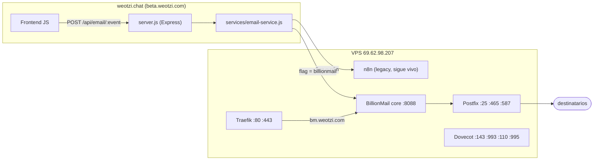

# Migración n8n -> BillionMail

**Fecha:** 2026-04-28
**Autor:** AI agent + Isaí
**Estado:** Fases 1, 2, 4, 5, 6 completadas. Plantillas convertidas localmente. Pendiente: DNS del usuario + subir plantillas + testing.

## Objetivo

Reemplazar el envío de correos del proyecto We Ötzi (transaccionales, notificaciones, newsletter) que actualmente pasa por webhooks de **n8n**, por una solución self-hosted basada en **BillionMail** ([github.com/aaPanel/BillionMail](https://github.com/aaPanel/BillionMail)). La migración es gradual con feature flag por evento; al final n8n queda apagado.

## Decisiones tomadas (con el usuario)

| Decisión | Valor | Justificación |
|----------|-------|---------------|
| Hosting BillionMail | VPS Hostinger Ubuntu 24.04 KVM 2 (`69.62.98.207`, root SSH) | Ya provisionado |
| Arquitectura de invocación | **Backend-centralizado**: frontend -> `POST /api/email/<event>` -> server.js -> BillionMail | Oculta la API key, payloads validados, monitoreable |
| Dominio de envío | `bm.weotzi.com` + remitente `noreply@weotzi.com` | `mail.weotzi.com` ya estaba en uso (CNAME a Google) |
| Estrategia de cutover | **Gradual con feature flag por evento** | Toggle (`n8n` / `billionmail` / `dual` / `off`) en backoffice |

## Estado actual del VPS

EasyPanel + Traefik + stack `chatbot-we-otzi` (incluye el n8n actual). Coexistencia limpia con BillionMail:

| Servicio | Puerto | Estado |
|----------|--------|--------|
| Traefik (EasyPanel) | 80, 443 | Routing inverso para todos los subdominios |
| EasyPanel UI | 3000 | OK |
| n8n (chatbot-we-otzi) | 5678 vía Traefik | Atendiendo webhooks actuales |
| Evolution API + Postgres + Redis | internos | OK (chatbot WhatsApp) |
| BillionMail Postfix | 25 / 465 / 587 | Up |
| BillionMail Dovecot | 110 / 143 / 993 / 995 | Up |
| BillionMail core (HTTP) | 8088 / 8443 (interno) | Up. Traefik proxy: `bm.weotzi.com` -> 8088 |
| BillionMail Postgres / Redis / rspamd / webmail | internos | Up |

## Arquitectura objetivo



## Fases (estado real al cierre)

- [x] **Fase 1.a** Docker + Compose pre-flight (ya estaban instalados)
- [x] **Fase 1.b** `.env` configurado en `/opt/billionmail/.env` (puertos 8088/8443, hostname `bm.weotzi.com`)
- [x] **Fase 1.c** Stack BillionMail levantada (7 contenedores Up)
- [ ] **Fase 1.d** DNS records propagados (A, SPF, DKIM, DMARC, PTR) -- ACCIÓN DEL USUARIO
- [x] **Fase 1.e** Traefik enruta `bm.weotzi.com` -> `billionmail-core-billionmail-1:8088` (Let's Encrypt al primer hit cuando DNS responda)
- [ ] **Fase 1.f** Email de prueba enviado y recibido (SPF/DKIM/DMARC OK) -- después de DNS + plantillas
- [x] **Fase 2** `services/email-service.js` + endpoints `/api/email/*` (probado local: GET events, POST test, POST :eventId, channel=off, channel=billionmail sin API key)
- [~] **Fase 3** 31 plantillas convertidas en `templates/email/billionmail/` (sintaxis BillionMail, manifest.json con variables); falta subirlas con API key
- [x] **Fase 4** Frontend usando `email-client.js` (inyectado en 22 HTMLs; `ConfigManager.sendN8NEvent` delega al backend con fallback legacy)
- [x] **Fase 5** server.js disparadores (verification, bid) refactorizados a `emailService.sendEmail` (fire-and-forget, respeta feature flag)
- [x] **Fase 6** UI backoffice "Email Routing": dropdown por evento + bulk actions + test inline
- [ ] **Fase 7** Cada evento validado con dual-send
- [ ] **Fase 8** Cutover completo
- [ ] **Fase 9** n8n decomisionado, docs actualizados

## Lo que necesitas hacer tú (Isaí)

### 1. DNS A record (5 min)

En tu DNS provider para `weotzi.com`:

| Tipo | Host | Valor | TTL |
|------|------|-------|-----|
| A | `bm` | `69.62.98.207` | 300 |

Esto desbloquea: panel HTTPS accesible en `https://bm.weotzi.com/<SafePath>/` y Traefik puede emitir cert Let's Encrypt al primer request.

### 2. PTR / rDNS (5 min)

Panel Hostinger del VPS -> Networking -> Reverse DNS:

`69.62.98.207` -> `bm.weotzi.com`

Crítico para deliverability. Sin PTR los correos caen en spam.

### 3. Mientras DNS propaga (opcional): SSH tunnel al panel

```powershell
ssh -L 8443:127.0.0.1:8443 root@69.62.98.207
```
En otra ventana abrir `https://localhost:8443/<SafePath>/`. Las credenciales están en `.billionmail-panel-credentials` (gitignored).

### 4. Cuando DNS resuelva, en el panel:

1. Settings -> Domain Setup: añadir `weotzi.com` como dominio de envío.
2. BillionMail genera los TXT records (SPF, DKIM, DMARC). Añadirlos al DNS de `weotzi.com`. Si tienes Google Workspace, **combinar el SPF**: `v=spf1 include:_spf.google.com a:bm.weotzi.com ~all`.
3. Settings -> API: generar API key.
4. Test desde el panel a tu Gmail personal. Verificar `Show original`: SPF=PASS, DKIM=PASS, DMARC=PASS.

### 5. Pegar API key en el servidor + subir plantillas

```js
// ecosystem.config.js
BILLIONMAIL_API_KEY: 'la_clave_que_te_dio_el_panel'
```

Subir las 31 plantillas:
```powershell
$env:BILLIONMAIL_API_KEY="..."
python scripts/billionmail/upload_templates.py
```
(El script intenta varios endpoints; si todos fallan da instrucciones para subir manual desde Settings -> Email Templates.)

Redeploy a beta.weotzi.com con `python scripts/deploy_beta.py`.

### 6. Empezar a migrar eventos

Desde `https://beta.weotzi.com/backoffice` -> Email Routing.
Orden recomendado (de menos crítico a más crítico):

1. `client_survey_*`
2. `job_board_application_received`
3. `chat_message_*`
4. `session_*` (4 eventos)
5. `quotation_*` (5 eventos)
6. `profile_verified` / `verification_denied`
7. `password_reset_temp` (CRÍTICO)
8. `client_registration_completed` (CRÍTICO)
9. `artist_registration_completed` (CRÍTICO)

Por cada evento: dual -> 24-48h -> verificar -> billionmail.

### 7. Cuando todos en BillionMail estable, decommission n8n

- Mantener n8n 14 días por seguridad
- Después: detener container `chatbot-we-otzi_n8n`
- NO detener Evolution API ni el resto de la stack del chatbot
- Limpiar `N8N_WEBHOOK_URL` de configs

## Riesgos y mitigaciones

| Riesgo | Mitigación |
|--------|------------|
| Conflicto con Traefik en 80/443 | BillionMail core en 8088/8443, proxy Traefik |
| SPF/DKIM/DMARC mal configurados -> spam | Verificar con [mail-tester.com](https://www.mail-tester.com) antes de cutover |
| Reputación IP nueva | Calentamiento gradual (volúmenes pequeños primero) |
| BillionMail down | Feature flag `n8n` por evento permite rollback instantáneo |
| Romper Easypanel/n8n | Coexistencia: NO se toca la stack `chatbot-we-otzi` |
| Sin PTR | Solicitar a Hostinger antes de cutover |
| Caída del VPS | Backups del volumen `vmail-data`, `postgresql-data`, `core-data` |
| OneDrive borra scripts | Workspace está en OneDrive; los scripts python untracked se han borrado solos. Hacer commit pronto. |

## Archivos clave

| Archivo | Propósito |
|---------|-----------|
| [services/email-service.js](services/email-service.js) | Dispatcher central (n8n / BillionMail / dual / off) |
| [services/email-event-mapping.js](services/email-event-mapping.js) | Catálogo de los 23 eventos + mapeo a templates BillionMail |
| [public/shared/js/email-client.js](public/shared/js/email-client.js) | Cliente frontend (POST /api/email/...) |
| [public/shared/js/email-routing-admin.js](public/shared/js/email-routing-admin.js) | UI backoffice |
| [scripts/billionmail/_ssh.py](scripts/billionmail/_ssh.py) | Helper SSH compartido |
| [scripts/billionmail/install_billionmail.py](scripts/billionmail/install_billionmail.py) | Instala/actualiza BillionMail (idempotente) |
| [scripts/billionmail/configure_traefik.py](scripts/billionmail/configure_traefik.py) | Wirea Traefik a BillionMail |
| [scripts/billionmail/save_panel_credentials.py](scripts/billionmail/save_panel_credentials.py) | Refresca `.billionmail-panel-credentials` desde el VPS |
| [scripts/billionmail/convert_templates.py](scripts/billionmail/convert_templates.py) | n8n -> BillionMail template syntax |
| [scripts/billionmail/upload_templates.py](scripts/billionmail/upload_templates.py) | Sube plantillas via API (cuando haya API key) |
| [templates/email/billionmail/](templates/email/billionmail/) | 31 plantillas convertidas + manifest.json |
| `.billionmail-panel-credentials` | (gitignored) Admin user/pass + SafePath del panel |
| `.server-credentials-billionmail` | (gitignored) SSH del VPS |

## Variables de entorno

```env
# BillionMail
BILLIONMAIL_API_URL=https://bm.weotzi.com
BILLIONMAIL_API_KEY=
BILLIONMAIL_DEFAULT_SENDER=noreply@weotzi.com
BILLIONMAIL_TIMEOUT_MS=15000
```

## Referencias

- BillionMail repo: https://github.com/aaPanel/BillionMail
- BillionMail API: https://www.billionmail.com/start/api_mail_guide.html
- BillionMail API setup: https://www.billionmail.com/start/api_usage_guide.html
- Doc legacy de webhooks n8n: [docs/N8N_EMAIL_WEBHOOKS.md](docs/N8N_EMAIL_WEBHOOKS.md)
- Skill server: [.agents/skills/server-infrastructure/SKILL.md](.agents/skills/server-infrastructure/SKILL.md)
